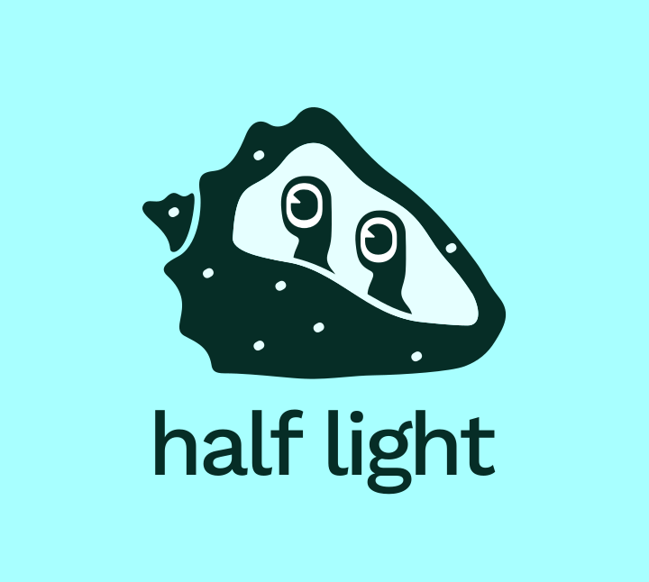

# Half Light 

    

[bicycle.codes/halflight](https://www.bicycle.codes/halflight)

## what is this?
This is a server/social-network for sharing images. All posts are end to end encrypted, so you know exactly who is able to see your content.

## Private by default social networking
All content is e2e encrypted. That means no one is able to read your messages except the recipients, not even the server operator.

This project is designed to share images via a social network. It started with using services that are more traditional — a DB and blob host, + UCANs for ID. But, [wnfs](https://guide.fission.codes/developers/webnative/file-system-wnfs) has a way to set read permissions on a per-user basis, so we can e2e encrypt *everything*. It's interesting because it is based on decryption capabilities instead of access control.

-----------------

The social part is all configurable too, at a pretty granular level. So you can configure things like -- do you want to let your friends see who your other friends are? Or hide that info from everyone? In any case, you *get to choose* who can read that. Not even the server-operator is able to read that info, unless you allow them to.

This is a big difference from traditional social networks, like *Instagram*, where the server reads/knows all your data.

## relevant links

* [join the discord server](https://discord.gg/SxWNsDMxT4)
* [bicycle.codes/halflight](https://www.bicycle.codes/halflight)

