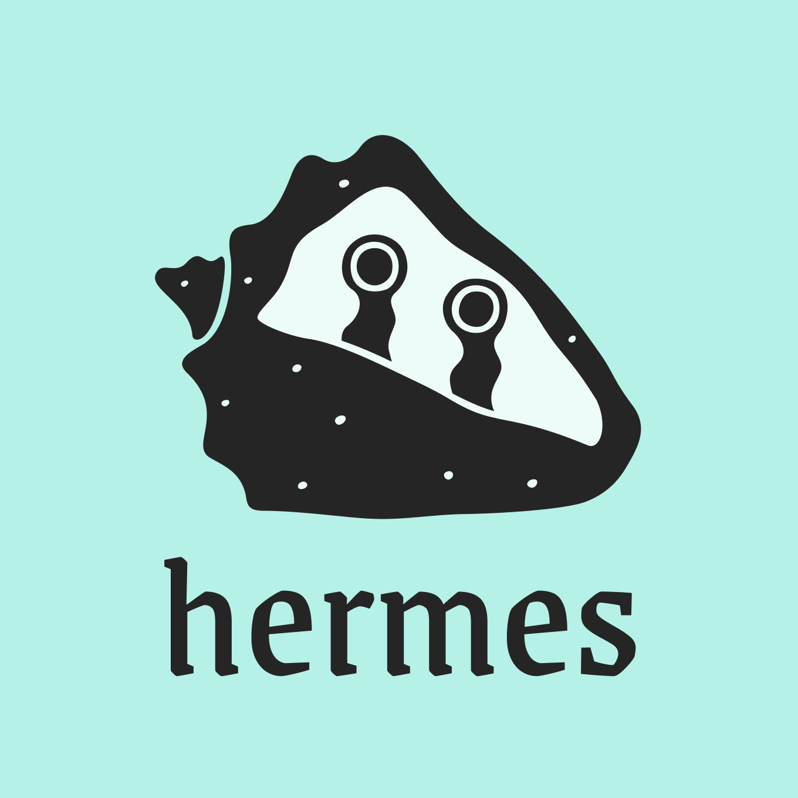

# hermes 

    

## Private by default social networking
At a high level this is like *Signal*, the messaging app, in the sense that no one is able to read your messages except the recipients.

This project is designed to share images via a social network. It started with using services that are more traditional — a DB and blob host, + UCANs for ID.

But [wnfs](https://guide.fission.codes/developers/webnative/file-system-wnfs) already has a way to do read permissions on a per-user basis, so we can e2e encrypt *everything*. It's kind of interesting because it's all based on decryption capabilities instead of access control.

And `wnfs` gives us a common backend / ID-source for users, which makes identity easier, since `webCrypto` private keys cannot be cross-domain.

--------------

> to share private files with a group of people, you would need to write down the list of people in the group. Then call `fs.sharePrivate` and pass it the list of other users.
So `wnfs` I think has everything needed for this usecase. At this point it's more a matter of finding time to try this & build some UI for it.

-----------------

The social part is all configurable too, at a pretty granular level. So you can configure things like -- do you want to let your friends see who your other friends are? Or hide that info from everyone? In any case, you *get to choose* who can read that. Not even the server-operator is able to read that info, unless you allow them to.

This is a big difference from traditional social networks, like *Instagram*, where the server reads/knows all your data.
